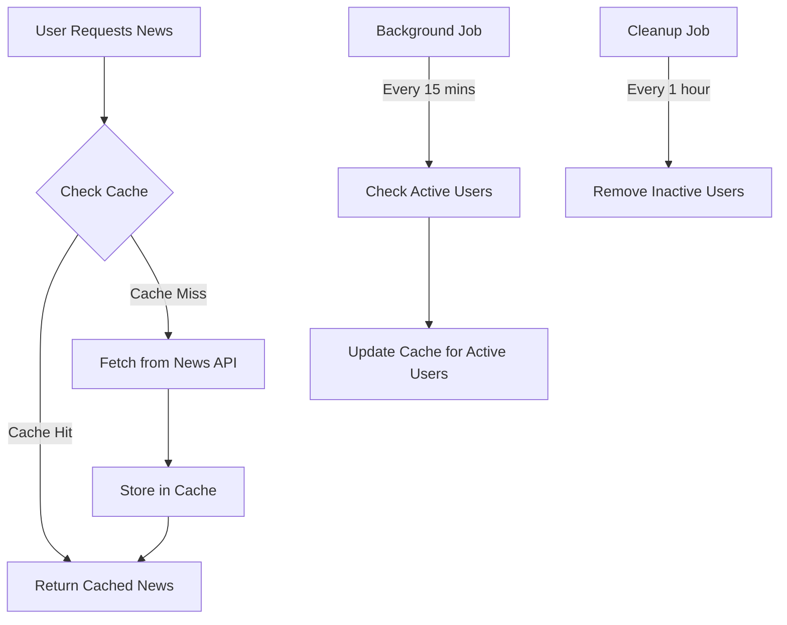

# 📰 News Aggregator API

> A modern Spring Boot application that provides a RESTful API for aggregating and managing news articles from various sources, with intelligent caching and user preference management.

## ✨ Key Features

- 🔐 **Secure Authentication** - JWT-based user authentication and authorization
- 🎯 **Personalized News** - User-specific news preferences and content
- 🔍 **Advanced Search** - Powerful news search and filtering capabilities
- ⚡ **Smart Caching** - Intelligent background cache updates for active users
- 🛡️ **Rate Limiting** - Protection against API abuse
- 📊 **Analytics** - Track user engagement and article interactions

## 🏗️ Technical Architecture

### Security Layer 🔒
- **JWT Authentication**
  - Token-based authentication with refresh capabilities
  - Secure password hashing using BCrypt
  - Role-based access control (RBAC)
  - Custom security filters and entry points for better error handling

### Core Services 🎯

#### News Service
- Integration with external news APIs
- Smart caching with Caffeine
- Automatic background updates
- Error handling and retry mechanisms
- Rate limiting integration

#### Cache Management 📦

The application implements an intelligent caching system to optimize performance and reduce external API calls:

##### Cache Structure 🏗️
- **News Cache**: Stores personalized news feeds per user
- **Search Cache**: Stores search results for common keywords
- **User Preferences**: Caches user's news preferences

##### Cache Lifecycle 🔄


##### Key Features 🎯
1. **Smart Invalidation**
   - Cache entries expire after 15 minutes
   - Automatic refresh for active users
   - Manual invalidation on preference updates

2. **Resource Optimization**
   - Batch processing for updates
   - Configurable cache sizes
   - Memory-efficient storage

3. **Error Handling**
   - Graceful degradation to stale data
   - Retry mechanism for failed updates
   - Error logging and monitoring

##### Cache Configuration ⚙️
```properties
# Cache TTL Settings
news.cache.ttl=900000                    # 15 minutes
news.cache.cleanup.interval=3600000      # 1 hour
news.cache.max-size=1000                 # Max entries

# Update Strategy
news.cache.batch-size=10                 # Updates per batch
news.cache.retry-attempts=3              # Failed update retries
```

#### Background Tasks ⚙️
- Scheduled cache updates every 15 minutes
- User activity tracking
- Inactive user cleanup
- Resource optimization

## 🛠️ Technical Stack

### Backend Framework
- **Spring Boot 3.x**
  - Spring Security
  - Spring WebFlux
  - Spring Cache
  - Spring Scheduler

### Database & Caching
- 💾 **H2 Database** - For development
- 📦 **Caffeine Cache** - In-memory caching

### Security & Performance
- 🔑 **JWT** - Authentication & Authorization
- ⚡ **Bucket4j** - Rate limiting

## 🚀 API Endpoints

### Authentication Endpoints
```http
POST /api/auth/register - Register new user
POST /api/auth/login    - Login and get JWT
POST /api/auth/refresh  - Refresh JWT token
```

### News Management
```http
GET  /api/news                    - Get personalized news feed
GET  /api/news/search/{keyword}   - Search articles
POST /api/news/{id}/favorite      - Mark article as favorite
GET  /api/news/favorites          - Get favorite articles
```

### User Preferences
```http
GET  /api/preferences      - Get news preferences
PUT  /api/preferences      - Update preferences
```

## ⚙️ Configuration

### Application Properties
```properties
# JWT Configuration
jwt.secret=your-secret-key
jwt.expiration=86400000

# News API Configuration
news.api.key=your-api-key
news.api.base-url=https://newsapi.org/v2

# Cache Configuration
spring.cache.cache-names=newsCache,searchCache
spring.cache.caffeine.spec=maximumSize=1000,expireAfterWrite=900s

# Background Task Configuration
news.cache.update.interval=900000      # 15 minutes
news.cache.cleanup.interval=3600000    # 1 hour
news.cache.user-inactivity=86400000    # 24 hours
```

## 🚀 Getting Started

1. **Clone the Repository**
   ```bash
   git clone https://github.com/yourusername/news-aggregator-api.git
   ```

2. **Configure Application**
   - Set up application.properties
   - Configure your News API key

3. **Build & Run**
   ```bash
   ./mvnw clean install
   ./mvnw spring-boot:run
   ```

## 📊 Error Handling

### HTTP Status Codes
- 🟢 **2xx** - Success
- 🟡 **4xx** - Client Errors
  - 401 - Unauthorized (Invalid/Expired JWT)
  - 403 - Forbidden (Insufficient permissions)
  - 429 - Too Many Requests (Rate limit exceeded)
- 🔴 **5xx** - Server Errors

### Error Response Format
```json
{
    "success": false,
    "message": "Error description",
    "errorCode": "ERROR_CODE",
    "errorDetails": "Detailed error message",
    "timestamp": "2023-05-04T00:17:58+05:30"
}
```


## 🤝 Contributing

1. Fork the repository
2. Create your feature branch (`git checkout -b feature/amazing-feature`)
3. Commit your changes (`git commit -m 'Add amazing feature'`)
4. Push to the branch (`git push origin feature/amazing-feature`)
5. Open a Pull Request


## 👥 Authors

- **Chirag Arora** - *Initial work* - [GitHub Profile](https://github.com/yourusername)

## 🙏 Acknowledgments

- Spring Boot Team
- News API
